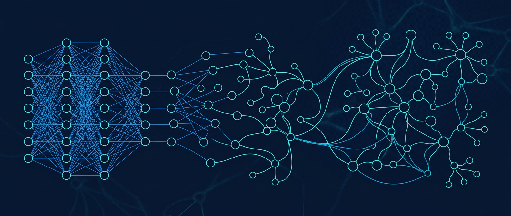
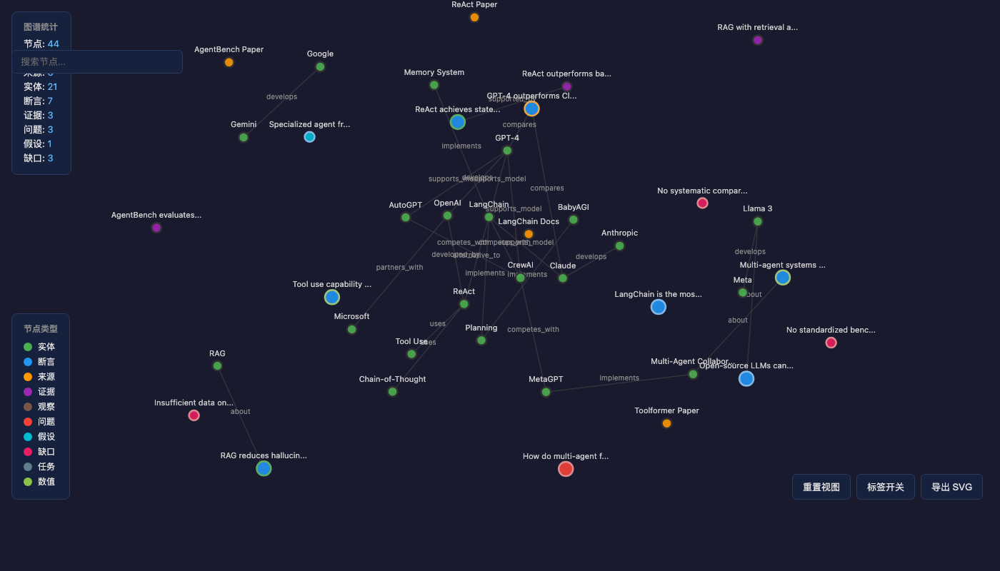

<div align="center">
  
</div>

<div align="center">

# Agent Knowledge Graph CLI (`kg`)

**AI Agent 的结构化长期记忆**

[](./LICENSE)
[](https://bun.sh)
[](https://www.typescriptlang.org/)
[](./CONTRIBUTING.md)

[English](./README.md) · [报告 Bug](https://github.com/fanghuzhaowen/agent-knowledge-graph-cli/issues) · [功能建议](https://github.com/fanghuzhaowen/agent-knowledge-graph-cli/issues)

</div>

图谱驱动的迭代式深度调研工具。面向 LLM/Agent 调用设计，CLI 只做图谱操作与任务编排，不直接调用模型。

## 一览

```
 kg new-topic "AI 安全调研"
        │
        ▼
 ┌─────────────────────────────────────────────┐
 │               kg.json (知识图谱)              │
 │                                             │
 │  [来源] ──提取──▶ [断言] ◀──支持── [证据]     │
 │     │               │                       │
 │   关联            争议                      │
 │     │               │                       │
 │     ▼               ▼                       │
 │  [实体]          [问题] ◀──回答── [缺口]     │
 └─────────────────────────────────────────────┘
        │
        ▼  (Agent 循环直至填补所有知识缺口)
 ┌─────────────────────────────────────────────┐
 │  ✅ 有据可依的研究报告                        │
 │  ✅ 带溯源链的已验证断言                      │
 │  ✅ 已识别的知识缺口与待答问题                 │
 └─────────────────────────────────────────────┘
```

## 为什么 AI Agent 需要 `kg`？

大模型的推理能力取决于上下文质量。`kg` 为 Agent 提供了**结构化的长期记忆**——将碎片化的调研信息组织为可查询、可推理的知识图谱，让 Agent 在多轮迭代中保持认知一致性，而非在海量原始文本中迷失。

**核心价值：**

- **图谱即记忆** — Agent 不再依赖滑动窗口或向量检索，而是通过实体、断言、证据、问题的语义关系网络来存取和推理知识
- **零模型耦合** — CLI 不调用任何 LLM API，只输出标准化的 `LlmTaskEnvelope`（含上下文、指令、prompt 模板、输出 schema），Agent 自由选择模型和调用方式
- **证据链追踪** — 每条 Claim 都可溯源到原始 Source → Evidence → 链接关系，支持 `supports / contradicts / weakly_supported` 等多种证据角色，Agent 能做到真正的循证推理
- **缺口自动检测** — `gap detect` 主动发现知识盲区（无证据支撑的断言、未回答的问题、孤立节点），驱动 Agent 下一轮自主搜索
- **迭代式研究循环** — `research continue` 编排完整的"搜索→提取→质疑→补缺"循环，Agent 只需循环调用即可完成深度调研
- **外置流程记忆** — 任务清单（Checklist）持久化到磁盘，Agent 跨会话恢复时能无缝续接未完成工作
- **轻量无依赖** — 单文件 JSON 存储（`kg.json`），无需数据库，零运维成本，适合嵌入任何 Agent 工具链

**典型 Agent 集成架构：**

```
┌─────────────┐    CLI 调用     ┌─────────────┐    LLM 调用    ┌─────────────┐
│  Agent 主控  │ ──────────────→ │   kg CLI    │               │  LLM API    │
│  (Python/TS) │ ←── JSON 输出 ──│  (本工具)    │               │ (GPT/Claude) │
│             │                 │             │               │             │
│  搜索/抓取   │                 │  图谱操作    │               │             │
│  结果回写    │                 │  任务编排    │               │             │
└─────────────┘                 └─────────────┘               └─────────────┘
       │                               │
       │         回写结果               │  读取 kg.json
       └───────→ temp/{topic}/ ←───────┘
                  ├── kg.json
                  ├── search_results/
                  └── pages/
```

## 安装

```bash
# 克隆并安装
git clone https://github.com/fanghuzhaowen/agent-knowledge-graph-cli.git
cd agent-knowledge-graph-cli
bun install
```

## 快速开始

```bash
# 创建新调研主题
bun run kg new-topic "Gemma4评测"

# 所有后续命令通过 --dir 指定研究目录
DIR="./temp/Gemma4评测_1712130000000"

# 创建调研任务
bun run kg task create --title "Gemma4 评测调研" --goal "评估官方 benchmark 是否有独立证据支持" --dir $DIR

# 添加来源
echo '{"title":"Gemma 4 Technical Report","type":"webpage","attrs":{"uri":"https://example.com/gemma4-report","author":"Google"}}' | bun run kg node upsert --json-in - --dir $DIR

# 查看所有节点
bun run kg node list --dir $DIR
```

## 命令总览

### 基础图谱操作

```bash
# 节点
bun run kg node get <id> --dir <dir>
bun run kg node list [--kind Entity] [--status open] --dir <dir>
bun run kg node upsert --json-in data.json --dir <dir>
bun run kg node delete <id> --dir <dir>

# 边
bun run kg edge create --from ent_1 --type related_to --to ent_2 --dir <dir>
bun run kg edge get <id> --dir <dir>
bun run kg edge list [--from ent_1] [--type related_to] --dir <dir>
bun run kg edge delete <id> --dir <dir>
```

### 证据管理

```bash
# 添加来源
echo '{"title":"论文标题","type":"webpage"}' | bun run kg node upsert --json-in - --dir <dir>

# 查看来源
bun run kg source get <id> --dir <dir>

# 添加证据
echo '{"sourceId":"src_xxx","text":"原文引用片段","kind":"Evidence"}' | bun run kg node upsert --json-in - --dir <dir>

# 链接证据到 Claim
bun run kg evidence link --evidence ev_1 --target clm_1 --role supports --dir <dir>

# 查看某个目标的所有证据
bun run kg evidence list --target clm_1 --dir <dir>
```

### Claim 管理

```bash
# 创建 Claim
echo '{"text":"Gemma 4 31B 在 MMLU Pro 上达到 85.2%","status":"proposed","kind":"Claim"}' | bun run kg node upsert --json-in - --dir <dir>

# 更新状态
bun run kg claim set-status clm_1 supported --dir <dir>

# 查看冲突
bun run kg claim conflicts clm_1 --dir <dir>
```

### Question / Hypothesis

```bash
# 添加问题
echo '{"text":"是否有第三方独立评测？","status":"open","kind":"Question"}' | bun run kg node upsert --json-in - --dir <dir>

# 列出未解决问题
bun run kg node list --kind Question --status open --dir <dir>

# 添加假设
echo '{"text":"独立评测分数可能低于官方","status":"proposed","kind":"Hypothesis"}' | bun run kg node upsert --json-in - --dir <dir>
```

### 图谱查询

```bash
# 邻居遍历（BFS）
bun run kg graph neighbors ent_1 --depth 2 --dir <dir>

# 子图提取
bun run kg graph subgraph --focus ent_1 --depth 2 --dir <dir>

# 统计
bun run kg graph stats --dir <dir>

# 图谱检查
bun run kg graph lint --dir <dir>
```

### 缺口检测

```bash
# 自动检测知识缺口
bun run kg gap detect --dir <dir>

# 查看已检测到的缺口
bun run kg gap list --dir <dir>
```

### 图谱可视化

将知识图谱导出为单个交互式 HTML 文件，内置 D3.js 力导向布局。

```bash
# 导出完整图谱
bun run kg graph export-html -o graph.html --dir <dir>

# 导出指定节点的子图
bun run kg graph export-html -o graph.html --focus ent_1 --depth 3 --dir <dir>

# 导出指定任务的图谱
bun run kg graph export-html -o graph.html --task task_1 --dir <dir>
```

**功能特性：**

- 力导向布局，支持拖拽和缩放
- 节点按类型着色（实体、断言、来源、证据等）
- 节点边框按状态着色（已支持、争议中、待解决等）
- 点击节点查看详细信息侧边栏
- 按标题或内容搜索节点
- 导出为 SVG
- 内置统计面板和图例

<div align="center">
  
</div>

### 报告生成

```bash
# 生成 Markdown 报告
bun run kg report generate --task task_1 --dir <dir>

# 生成 JSON 格式报告
bun run kg report generate --task task_1 --format json -o report.json --dir <dir>

# 列出所有引用
bun run kg report citations --dir <dir>
```

### LLM 任务编排

所有 `llm` 命令不直接调用模型，只输出 JSON 格式的 `LlmTaskEnvelope`（含上下文、指令、推荐 prompt、输出 schema），由上层 Agent 执行。

```bash
# 从来源提取实体
bun run kg llm extract-entities --source src_1 --dir <dir>

# 从来源提取断言
bun run kg llm extract-claims --source src_1 --dir <dir>

# 生成新研究问题
bun run kg llm generate-questions --dir <dir>

# 生成下一轮搜索词
bun run kg llm next-search-queries --dir <dir>

# 评估证据质量
bun run kg llm assess-evidence --claim clm_1 --dir <dir>

# 实体/Claim 去重
bun run kg llm normalize-entities --dir <dir>
bun run kg llm normalize-claims --dir <dir>
```

## LLM 任务输出示例

```json
{
  "taskType": "extract_claims",
  "graphContext": {
    "focusNodeIds": ["src_1"],
    "relatedNodes": [...],
    "relatedEdges": [],
    "relatedEvidence": []
  },
  "inputContext": {
    "source": { "id": "src_1", "title": "..." },
    "existingClaims": [...]
  },
  "instructions": "Extract candidate factual claims...",
  "recommendedPrompt": "You are given a source...",
  "outputSchema": { "type": "object", "properties": { "claims": { "type": "array" } } },
  "executionHint": {
    "suggestedCommand": "kg node upsert --json-in claims.json"
  }
}
```

## 节点类型

| 类型 | 说明 | 关键字段 |
|------|------|----------|
| `Entity` | 客观对象（人/组织/概念/...） | type, title |
| `Claim` | 可验证断言 | text, status, confidence |
| `Source` | 原始来源 | title, attrs.uri |
| `Evidence` | 证据片段 | text, attrs.sourceId |
| `Observation` | 候选事实 | text, status |
| `Question` | 待回答问题 | text, status, attrs.priority |
| `Hypothesis` | 待验证假设 | text, status |
| `Gap` | 知识缺口 | text, attrs.gapType |
| `Task` | 调研任务 | title, goal, status |
| `Value` | 数值节点 | text |

## Claim 状态流转

```
proposed → supported → deprecated
         → weakly_supported → contested → contradicted
                                    → superseded
```

## 存储格式

每个研究目录包含一个 `kg.json` 文件，存储所有节点、边、证据链接和操作日志。

```
temp/{topic}_{timestamp}/
├── kg.json          # 唯一数据来源
├── search_results/  # 搜索原始结果（由上层 Agent 管理）
└── pages/           # 抓取页面全文（由上层 Agent 管理）
```

## 与其他方案对比

| | `kg`（本工具） | RAG / 向量数据库 | 纯 LLM 上下文 | 知识图谱数据库 |
|---|---|---|---|---|
| **结构化关系** | ✅ 实体、断言、证据 | ❌ 扁平分块 | ❌ 非结构化 | ✅ 完整图谱 |
| **证据可溯源** | ✅ 来源→证据→断言 | ❌ 仅相似度 | ❌ 无 | ⚠️ 需手动配置 |
| **缺口检测** | ✅ 内置 | ❌ | ❌ | ❌ |
| **Agent 就绪** | ✅ LlmTaskEnvelope | ❌ | ❌ | ❌ |
| **零基础设施** | ✅ 单个 JSON 文件 | ❌ 需向量数据库 | ✅ | ❌ 需图数据库 |
| **模型无关** | ✅ 任意 LLM | ✅ | ✅ | ✅ |

## 路线图

> 还没想好。。。 🤔

## 贡献指南

欢迎贡献！请阅读 [CONTRIBUTING.md](./CONTRIBUTING.md) 了解详情。

1. Fork 本仓库
2. 创建功能分支 (`git checkout -b feature/amazing-feature`)
3. 提交改动 (`git commit -m 'feat: add amazing feature'`)
4. 推送到分支 (`git push origin feature/amazing-feature`)
5. 发起 Pull Request

## 更新日志

查看 [CHANGELOG.md](./CHANGELOG.md) 了解版本历史。

## 测试

```bash
bun test              # 单元测试
bun test tests/e2e/   # E2E 测试
```

## License

[MIT](./LICENSE) © misakaikato

<div align="center">

**[⬆ 回到顶部](#agent-knowledge-graph-cli-kg)**

</div>
